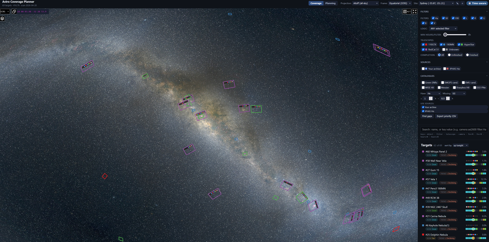

# Astro Coverage Planner

**See what you've already imaged. Plan what's next. Hand it to NINA.**

A web-based coverage viewer **and** session planner for astrophotographers. Point it at a folder of FITS/XISF masters; it builds a manifest of every field of view you've ever shot, renders them on an Aladin Lite sky map (colored by telescope, badged by filter, depth-sliced by hours), and lets you plan future sessions with mosaic support — exporting straight to NINA's Target Scheduler plugin.



> Built originally against my Ha/SII/OIII archive to find targets where Ha data exists but SII doesn't. Spun out so others can do the same.

## Who this is for

You'll get value out of this if you:

- Have **more than a few hundred captured masters** and want one map showing where they all sit on the sky.
- Shoot **narrowband** and want to see which targets have Ha but no SII, or any other filter-gap pattern.
- Use **multiple telescopes** and want each rig's FOVs visually distinguished (color + filter badge per polygon).
- Plan sessions with **mosaics** and want the panel layout, rotation, and per-filter exposure goals captured in one place — and synced to NINA Target Scheduler so you don't re-enter targets manually.
- Want a **single source of truth** for "what have I covered, where are the gaps, what's next" without juggling spreadsheets.

If you have a few dozen images and image one target at a time without TS, this is overkill — the value compounds with archive size and rig count.

## See it in action

### Scan an archive, browse the coverage


Run the scanner on your image roots; the manifest builds in ~5 minutes for a 100k-file archive. Open the app, click any FOV polygon to see its filter coverage, observed hours, and gear used.

### Smart search across your archive


The right-rail search supports a small grammar:

| Token | Effect |
|---|---|
| `eta carinae` | substring match across object names |
| `"north america"` | quoted phrases preserve spaces |
| `object:M42` / `name:rosette` | restrict to object/target name |
| `filter:Ha` | only targets with Ha data |
| `telescope:RedCat` / `tel:edge` | by telescope (fuzzy) |
| `camera:2600MM` / `cam:294` | by camera |
| `hours>5` / `hours<2` | total integration hours |
| `fov>60` / `fov<10` | FOV size in arcmin |

Tokens combine with AND. Bare words match object names. Use it to find e.g. `filter:Ha -filter:SII tel:redcat` for "RedCat-shot Ha targets without SII".

### Plan a session, lay out a mosaic


Switch to **Planning mode** in the topbar. Click sky to drop a target center, pick telescope + camera (FOV box auto-derives from gear), set per-filter target hours and sub-exposure. Mosaic? Set rows × columns × overlap %, drag the rotation handle to align the panel grid. Solid borders mean data logged; dashed mean not yet started.

### Catalog overlays for gap-finding


Toggle Green 2019 SNRs, SMGPS / EMU SNR candidates, or WISE HII regions. Combined with the filter-gap search, you can quickly spot e.g. confirmed SNRs you've shot in Ha but never in OIII.

### Gear editor with auto-seed


First time you open Planning mode, the planner scans your manifest and auto-imports every telescope and camera it finds — with focal length, aperture, pixel size, sensor size, and observed filters carried over from FITS headers. Tweak in the gear editor, fill in anything the headers didn't capture (e.g. gain/offset on older files), re-run "Scan coverage" after rebuilding the manifest.

### Sync to NINA Target Scheduler


Click **Sync** and the planner builds a Target Scheduler plugin import zip — `metadata.json`, `profilePreference.json`, `exposureTemplates.json`, `projects.json`. Mosaics expand to per-panel TS targets. If TS is installed locally, it offers existing exposure templates from `schedulerdb.sqlite` in a dropdown so you can map filters to your real TS templates rather than auto-generated ones.

## Quickstart (demo data)

```bash
pip install -r requirements.txt
python scripts/make_demo_manifest.py       # writes data/manifest.json (demo)
python app.py                              # http://127.0.0.1:5555
```

Open `http://127.0.0.1:5555/` in your browser. The demo has five well-known southern-sky targets so you can see what the viewer does.

## Full setup (your own FITS archive)

1. **Install dependencies.**
   ```bash
   pip install -r requirements.txt
   ```

2. **Build the manifest** from your FITS/XISF archive. Set `FITS_ROOTS` (one or more image roots, semicolon-separated) before running:
   ```bash
   FITS_ROOTS="D:/Astro/Images;E:/Archive" python scripts/build_archive_manifest.py
   ```
   On Windows PowerShell:
   ```powershell
   $env:FITS_ROOTS="D:/Astro/Images;E:/Archive"
   python scripts/build_archive_manifest.py
   ```
   This walks the folder tree, opens every master FITS/XISF to read its WCS + gear headers (TELESCOP, INSTRUME, FOCALLEN, XPIXSZ, APTDIA, GAIN, OFFSET, XBINNING), clusters results into targets by sky position, and writes `data/manifest.json`. On a ~100k-file archive it takes ~5 minutes.

3. **Launch the webapp.**
   ```bash
   python app.py
   ```
   The app hot-reloads on manifest mtime, so you can rebuild without restarting.

4. **Open Planning mode → gear auto-seeds.** Switch to the "Planning" tab in the top bar. On first load, the planner scans your manifest and auto-imports every telescope + camera it finds (names, focal length, aperture, pixel size, sensor size, observed filters) into `data/gear.json`. Open the gear editor (pencil/"Edit gear" button in the plan editor) to review, fill in anything the headers didn't carry (e.g. `gain`/`offset` if your FITS didn't record them), and hit "Scan coverage" to re-merge later after rebuilding the manifest. The planner uses fuzzy name matching so "RedCat 51 APO" in your gear matches "RedCat 51" from a FITS header.

5. **Plan a session.** Click "+ New plan", pick a target (by name or by clicking the sky), select telescope + camera, set filter goals and mosaic geometry if needed. Footprints update live on the map — solid borders for plans with data logged, dashed for not-yet-started. Border color matches the telescope you selected.

6. **Sync to NINA Target Scheduler** (optional). Click "Sync" to export a TS plugin zip (metadata.json, profilePreference.json, exposureTemplates.json, projects.json) that imports directly into NINA. Mosaics expand to per-panel TS targets. See the Planner section below.

### Multiple image roots / output path / pipeline DB

The manifest builder takes its paths from env vars:

| Env var         | Default                            | Purpose                                                 |
|-----------------|------------------------------------|---------------------------------------------------------|
| `FITS_ROOTS`    | hardcoded list at top of script    | Semicolon-separated list of image roots                 |
| `MANIFEST_PATH` | `./data/manifest.json`             | Where to write (and where the webapp reads from)        |
| `FULL_MASTERS`  | `./state/full_masters` (if exists) | Extra root of stacked masters                           |
| `PIPELINE_DB`   | `./state/job_queue.db` (if exists) | Optional sqlite DB with `frames` table for sub-hours    |

```bash
FITS_ROOTS="D:/Astro/Images;E:/Archive" \
MANIFEST_PATH=./data/custom_manifest.json \
PIPELINE_DB=./my_pipeline.db \
    python scripts/build_archive_manifest.py

MANIFEST_PATH=./data/custom_manifest.json python app.py
```

The scanner expects one FITS/XISF file per master (stacked frame) with standard WCS keywords (CRVAL1/CRVAL2/CD1_1 etc. or CDELT1/CDELT2). Files classified as "sub" (unstacked individual exposures) are counted for hours but not plotted — only masters with WCS become FOV polygons.

### Optional: sub-integration hours from a pipeline DB

If you keep a SQLite DB tracking every captured sub-exposure with a `frames` table shaped like:

```sql
CREATE TABLE frames (
    object_name  TEXT,
    filter_name  TEXT,
    exptime      REAL,      -- seconds
    captured_at  TEXT,      -- ISO date
    path         TEXT
);
```

point `PIPELINE_DB` at it and the manifest will include per-target sub-hours (useful when you have far more subs captured than you've stacked). Without it, hours come solely from master headers (NCOMBINE × EXPTIME).

## Configuration (env vars)

| Var               | Default                                                     | Purpose                                              |
|-------------------|-------------------------------------------------------------|------------------------------------------------------|
| `MANIFEST_PATH`   | `./data/manifest.json`                                      | Path to manifest JSON (read by app; written by builder) |
| `CATALOGS_PATH`   | `./data/catalogs.json`                                      | Path to overlay catalogs                             |
| `GEAR_PATH`       | `./data/gear.json`                                          | Telescopes + cameras for the planner                 |
| `PLANS_PATH`      | `./data/plans.json`                                         | Saved session plans                                  |
| `TS_DB_PATH`      | `%LOCALAPPDATA%/NINA/SchedulerPlugin/schedulerdb.sqlite`    | NINA Target Scheduler DB (optional)                  |
| `ZIP_OUTPUT_DIR`  | `./data/exports`                                            | Where TS-sync zips are written                       |
| `HOST`            | `127.0.0.1`                                                 | Bind host (use `0.0.0.0` only on trusted networks)   |
| `PORT`            | `5555`                                                      | Bind port                                            |
| `ACP_EXTENSIONS_DIR` | `%APPDATA%/acp/extensions` (Win) / `~/.config/acp/extensions` | Directory of extension modules — see [Extensions](#extensions) |

## Optional: catalog overlays

To enable the Green SNR / WISE HII / SMGPS / EMU overlays:

```bash
python scripts/fetch_catalogs.py           # writes data/catalogs.json
```

Requires `astroquery` (already in `requirements.txt`). Data is pulled from VizieR; first run takes ~30s and is cached.

## Features

### Sky map
- **Aitoff / Mollweide / Orthographic / Gnomonic** projections.
- **Equatorial or Galactic** coordinate frames.
- FOV polygons color-coded by telescope; a per-FOV badge shows which filters cover that field.

### Filter controls
- Per-filter toggles (`Ha SII OIII L R G B V`).
- Logic modes: ANY, ALL, or `Have Ha but NOT SII` (gap-finder).
- Depth slider: minimum hours/filter (0–10h).

### Site + observability
- Presets for Sydney / Victoria, or enter custom lat/lon.
- Status bar shows how many targets are above 30° / 60° altitude right now.

### Catalog overlays
- Green 2019 SNRs (confirmed Galactic SNRs).
- SMGPS SNR candidates.
- EMU SNR candidates.
- WISE HII regions (Anderson 2014).

### Search grammar (right rail)
- Bare words match object names: `eta carinae`.
- Quoted phrases preserve spaces: `"north america"`.
- Key:value: `object:M42`, `name:rosette`, `filter:Ha`, `telescope:RedCat`, `tel:edge`, `camera:2600MM`, `cam:294`.
- Numeric comparators: `hours>5`, `hours<2`, `fov>60`, `fov<10`.
- Tokens combine with AND.

### Export
- CSV of overlay candidates where Ha ≥ 1h but SII < 0.5h (validation-gap bucket).

### Planner (Planning mode)
Switch to the "Planning" tab in the top bar.

- **Gear auto-seed from coverage.** On first load the planner scans your manifest and adds every telescope + camera it finds to `data/gear.json`. Re-run any time via the "Scan coverage" button in the gear editor after rebuilding the manifest.
- **Plan editor.** Pick a target (name, coordinates, or click on the sky), select telescope + camera, set filter goals (target hours + sub-exposure), priority, min altitude, meridian window.
- **Mosaics.** Set rows × columns × overlap % and the planner tiles panels around your center RA/Dec. Rotate the whole mosaic by dragging the handle. Default overlap is 15%, which is the sweet spot for gradient blending.
- **Live footprint previews.** Footprint color matches the selected telescope (same colors as your coverage legend; fuzzy name match handles "RedCat 51 APO" vs "RedCat 51"). Dashed borders for plans with no data yet; solid once you've logged actual hours.
- **NINA Target Scheduler sync.** "Sync" builds a TS plugin zip with projects.json / targets / exposureTemplates, merging plans by project, applying strictest-wins for conflicting altitude/priority/meridian settings. Templates map to your existing TS templates by name (set per filter in the gear editor) or are generated from camera gain/offset/bin.
- **TS template mapping.** If NINA Target Scheduler is installed locally, the planner reads its sqlite DB (`%LOCALAPPDATA%/NINA/SchedulerPlugin/schedulerdb.sqlite`) to offer existing templates in a dropdown.

## Manifest schema

Minimal shape:

```jsonc
{
  "scan_date": "2026-04-19T10:30:00",
  "total_targets": 5,
  "total_integration_hours": 28.9,
  "targets": [
    {
      "target_id": 1,
      "objects": ["Eta Carinae"],
      "center_ra_deg": 161.26,
      "center_dec_deg": -59.68,
      "center_l_deg": 287.60,
      "center_b_deg": -0.63,
      "fov_arcmin": [120.0, 90.0],
      "pix_arcsec": 1.5,
      "corners_icrs":     [[ra,dec], [ra,dec], [ra,dec], [ra,dec]],
      "corners_galactic": [[l,b],    [l,b],    [l,b],    [l,b]   ],
      "telescopes": ["RedCat 51"],
      "date_range": ["2025-01-01", "2025-12-31"],
      "filters": {
        "Ha":  {"total_hours": 3.2, "files": 12},
        "OIII":{"total_hours": 1.4, "files": 6}
      },
      "master_files": ["/path/to/master_H.fit"]
    }
  ]
}
```

Corner order for `corners_icrs`: `[SW, NW, NE, SE]` (the frontend places the filter badge on the NW corner and rotates it with the FOV).

See `scripts/make_demo_manifest.py` for a runnable example.

## API

| Endpoint                                 | Purpose                                   |
|------------------------------------------|-------------------------------------------|
| `GET /`                                  | Frontend HTML                             |
| `GET /api/manifest`                      | Slim manifest JSON                        |
| `GET /api/target/<id>`                   | Full target detail                        |
| `GET /api/catalogs`                      | Overlay catalogs                          |
| `GET /api/observability?lat=&lon=&time=` | Altaz for every target                    |
| `GET /api/export/priority`               | CSV of Ha-but-no-SII candidates           |
| `GET  /api/gear`                         | Current gear (telescopes + cameras)       |
| `POST /api/gear`                         | Persist gear edits                        |
| `POST /api/gear/seed`                    | Merge manifest-derived gear into gear.json|
| `GET  /api/plans`, `POST`, `PUT`, `DELETE` | CRUD for session plans                  |
| `GET  /api/ts-templates`                 | TS plugin's exposure templates (if installed) |
| `POST /api/sync`                         | Build NINA Target Scheduler import zip    |

## Extensions

Coverage planning often needs to reach into something ACP doesn't ship — a friend's shared FOV list, a club's target catalog, a small SQLite DB you keep alongside your archive. Rather than fork the app, drop a Python module into a known directory and ACP will load it at startup.

**Where they go.** `ACP_EXTENSIONS_DIR`, defaulting to `%APPDATA%\acp\extensions` on Windows and `~/.config/acp/extensions` elsewhere. Each entry is either a single `.py` file or a package directory.

**The contract.** Each extension defines a top-level `register(app)` callable that receives the Flask app. From there you can register blueprints, add routes, read `app.config`, attach teardown hooks — anything Flask supports. Extensions are loaded once at startup; failures in one are logged and don't block the others or the app itself.

**Example — expose a friend's shared FOV list as CSV.** Save as `friend_fovs.py` in your extensions dir:

```python
import json, csv, io
from pathlib import Path
from flask import Blueprint, Response

bp = Blueprint("friend_fovs", __name__)
SHARED = Path.home() / "shared" / "friend_fovs.json"

@bp.route("/api/ext/friend-fovs.csv")
def friend_fovs_csv():
    rows = json.loads(SHARED.read_text())
    buf = io.StringIO()
    w = csv.DictWriter(buf, fieldnames=["name", "ra", "dec", "fov_arcmin"])
    w.writeheader()
    w.writerows(rows)
    return Response(buf.getvalue(), mimetype="text/csv")

def register(app):
    app.register_blueprint(bp)
```

Drop the file in, restart, hit `http://127.0.0.1:5555/api/ext/friend-fovs.csv`.

**Trust.** Extensions run in-process as your user with no sandbox, so only load code you've read or written yourself.

**Failures.** Load and registration errors are logged via Python's `logging` under the `acp.extensions` logger — check there if an extension silently doesn't show up.

## Security notes

- `app.py` binds to `127.0.0.1` by default. Only switch to `0.0.0.0` on a trusted LAN — the server has no authentication and exposes your manifest (including file paths) over HTTP.
- The server is Flask's dev server. For anything beyond local use, front it with gunicorn/uwsgi behind a reverse proxy.

## License

MIT — see `LICENSE`.
