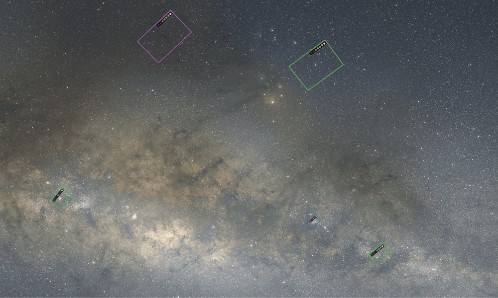
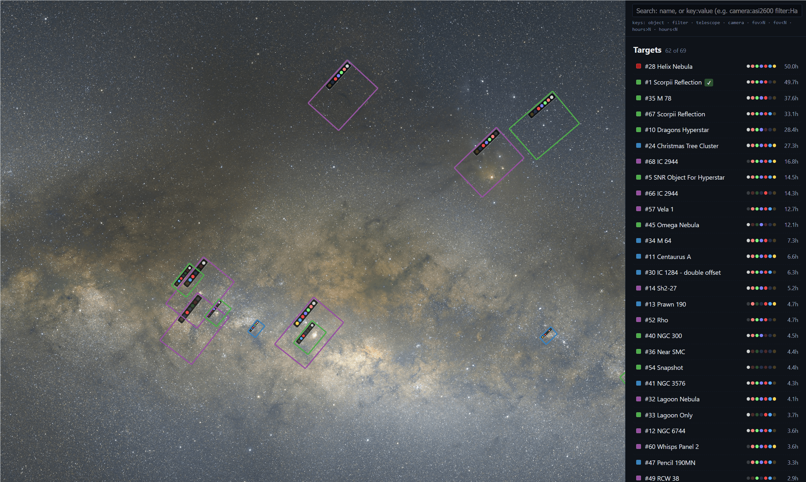
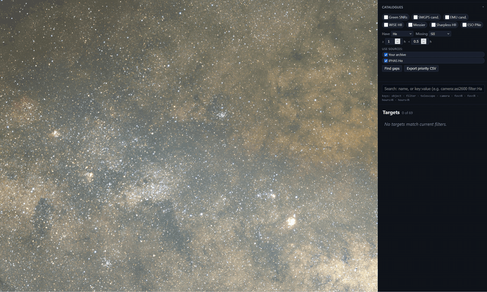
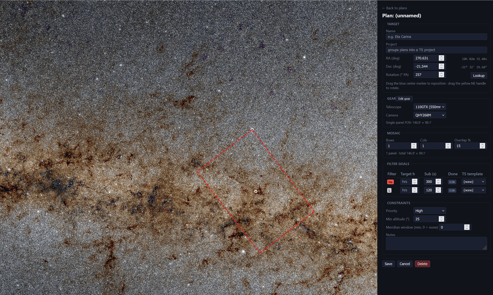

# Astro Coverage Planner

**See what you've already imaged. Plan what's next. Hand it to NINA.**

https://github.com/user-attachments/assets/b5051d71-84d9-4fcb-97a4-4a469166d09c

It's your astrophotography catalogue, visualised. ACP reads your entire FITS library and draws every field you've ever shot onto one sky map — coloured by telescope, badged by filter, with integration hours on every target. Useful from your first handful of targets and only gets more valuable as your library grows, especially if you're shooting narrowband or multi-night projects and want to see at a glance which targets are finished, which still owe you an OIII pass, and where your different rigs overlap. Plan your next session, next month, or next whole *year* in the same view — and export it straight to NINA Target Scheduler.

## Who this is for

ACP is built around a few specific imaging patterns. You'll get the most out of it if any of these sound like you:

- You shoot **with filters** (narrowband, LRGB, mixed) and want to see which targets are missing which channel.
- You build up integration **across multiple nights or multiple sessions** and want a clear picture of which projects are actually finished vs. half-done.
- You use **multiple telescopes** and want each rig's footprints visually distinguished on the same sky map (colour-coded, with filter badges per polygon).
- You plan sessions with **mosaics** and want the panel layout, rotation, and per-filter exposure goals captured in one place — and synced to NINA Target Scheduler so you don't re-enter targets manually.
- You want **one place** to answer "what have I shot, where are the gaps, what's next" without juggling spreadsheets or scrolling through folders.

You don't need a huge library for this to start paying off — even a couple of dozen targets is enough to surface projects you'd half-forgotten about. Most people wish they'd started this kind of catalogue years earlier.

## See it in action

Four moments that show what this is actually like to use.

### Your coverage on every sky survey

Same FOV polygons, same telescope colours — flip the background between optical, narrowband Hα, infrared, and radio surveys with one click. Hunting bright Hα regions you haven't shot? Switch to the Hα survey and scan for big patches with no polygons on them. Curious how a region looks in radio? One dropdown and you're there. ACP exposes Aladin Lite's full survey catalogue, so you've got dozens of professional astronomy datasets behind your map at all times.

### Smart search across your archive

The right-rail search supports a small grammar that combines with AND. Bare words match object names; everything else is `key:value`.

All search tokens

| Token | Effect |
|---|---|
| `eta carinae` | substring match across object names |
| `"north america"` | quoted phrases preserve spaces |
| `object:M42` / `name:rosette` | restrict to object/target name |
| `filter:Ha` | only targets with Hα data |
| `telescope:RedCat` / `tel:edge` | by telescope (fuzzy) |
| `camera:2600MM` / `cam:294` | by camera |
| `hours>5` / `hours<2` | total integration hours |
| `fov>60` / `fov<10` | FOV size in arcmin |

Use it for things like `filter:Ha -filter:SII tel:redcat` ("RedCat-shot Hα targets without SII") or `hours>5 fov<60` ("targets I've put serious time into with a tight rig"). The filtered list updates live as you type.

### Catalogue overlays for finding new targets

Toggle the Green 2019 SNR catalogue, SMGPS SNR candidates, WISE HII regions, the Messier and Sharpless lists, and ESO's planetary nebulae. Each one lights up its objects as markers across the sky. Combined with the survey-background swap above, you can pick a catalogue (say, confirmed SNRs), switch to the Hα survey, and scan for objects with bright emission you haven't shot yet — that's your shortlist for the next dark night.

### Plan your next session in the same map

Switch to **Planning mode** in the topbar. Click the sky to drop a target centre, pick telescope + camera (FOV box auto-derives from your gear), set per-filter target hours and sub-exposure. Doing a mosaic? Set rows × columns × overlap %, drag the rotation handle to align the panel grid. Solid borders mean data already logged; dashed borders mean not yet started. When the plan's ready, ACP can also sync it to NINA Target Scheduler so you're not re-typing targets.

## Get it running

You need **Python 3.10+** and **git** installed. If you don't have them yet, follow the [zero-to-hero install guide](docs/install.md) first — separate Windows, macOS, and Linux walkthroughs included.

Once they're there, anywhere with a terminal:

    git clone https://github.com/astro-roro/Astro-Coverage-Planner.git
    cd Astro-Coverage-Planner
    python -m venv .venv
    source .venv/bin/activate            # macOS/Linux
    .venv\Scripts\activate               # Windows PowerShell
    pip install -r requirements.txt
    python app.py

Open <http://127.0.0.1:5555/> in your browser. The first thing you'll see is an empty sky map with a banner pointing you at step two: scan your archive.

**Step two — point ACP at your FITS library.** See [Setting up your own archive](docs/setup-archive.md) — covers the manifest builder, multiple image roots, configuration variables, and the optional pipeline-DB integration for sub-exposure hours. Once it's built, refresh the page and your coverage will populate.

> **Just want to look around first?** Run `python scripts/make_demo_manifest.py` to load five well-known targets as sample data (M 42, M 31, Eta Carinae, M 45, M 8 — spanning both hemispheres), then refresh.

### A note on NINA Target Scheduler sync

ACP's coverage map, search, planner, and catalogues all run on Windows, macOS, and Linux. The **NINA Target Scheduler sync** feature is currently Windows-only — because NINA itself only runs on Windows. If you image from Mac or Linux but have a Windows box driving NINA, that works too: run ACP on whichever machine you like, and run the sync on the Windows side.

(Future plugins could push to Voyager, SGP, or other planners — the extension hooks are there.)

## Other things it does

The headline features are above. These are the secondary bits — the stuff that makes day-to-day use comfortable without needing to be the centrepiece.

### On the map
- **Four projections** — Aitoff, Mollweide, Orthographic, Gnomonic. Switch with one click; everything redraws live.
- **Equatorial or Galactic** coordinate frames.
- **Click any FOV polygon** for the full target detail — per-filter coverage breakdown, integration hours, gear used, master files behind it.
- **Horizon overlay** — translucent bands marking the never-up declination at your active site (red) and the below-minimum-altitude band (amber).

### Filtering and finding
- **Per-filter toggles** for Hα, SII, OIII, L, R, G, B (and any other filter ACP found in your headers — IDAS / IR / Astrodon variants surface automatically).
- **Logic modes**: ANY (matches any selected filter), ALL (matches every selected filter), or "have Hα but NOT SII" gap-finder logic.
- **Depth slider** — hide targets below a minimum hours-per-filter threshold (0–10h). Handy for filtering out the ones you've barely scratched.
- **Cross-source gap-finder** — pick a "have" filter and a "missing" filter, set hour thresholds, and ACP highlights every region of sky where one is covered but the other isn't, with public-catalogue candidates scattered inside the gap.
- **Saved searches** — name a combination of filter / priority / category settings and recall it later from a dropdown.

### Site and observability
- **Sites manager** — add, edit, and switch between observing locations (lat / lon / altitude / minimum-altitude threshold). Active site persists across reloads.
- **Live altitude status bar** showing how many targets are currently above 30° / 60° at your active site.
- **Time-aware mode** — toggle on to see what's observable across the night, not just right now. Adds:
  - **12-month visibility sparklines** on every target row (great / good / fair / partial / not visible per month).
  - **Now / Trend chips** — "Now: Good · ↑ Improving" or "Peaks in 4 months" when current conditions are bad.
  - **Sort options**: hours, best month, up tonight.

### Planning depth
- **Gear auto-seed** — first time you open Planning mode, ACP scans your manifest and imports every telescope and camera it found, including focal length, aperture, pixel size, sensor size, and the filters each rig has used. Tweak in the gear editor; re-run "Scan coverage" after rebuilding the manifest.
- **NINA Target Scheduler template mapping** — if NINA is installed locally, the planner reads its scheduler DB and offers your existing exposure templates in a dropdown, so plans use *your* templates rather than auto-generated ones.
- **Mosaic geometry** — rows × columns × overlap %, with a draggable rotation handle. Default 15% overlap is the sweet spot for gradient blending. Panels labelled by row/column (e.g. `Panel 3 (R1C2)`).

### Sharing and external data
- **Friend manifests** — load sanitised coverage manifests from imaging buddies as toggleable layers, so you can split the sky between you and avoid duplicating Hα hours on the same target. See [the sharing guide](docs/sharing.md).
- **Public survey coverage overlays** — toggle MOC footprints from CDS-hosted surveys (IPHAS DR2 Hα ships in the box; more easy to add) to see where professional surveys have already covered the sky alongside your own work. See [the public-survey docs](docs/public-surveys.md).
- **Plugin platform** — extensions can register custom coverage sources, ranked tile inventories, class-tagged catalogues, or UI actions (buttons + toggles in the planning rail, including swapping a core button for an extension-supplied one) and they show up alongside the built-ins. See [the extensions guide](docs/extensions.md) for the protocols and the manifest API.

### Export
- **CSV export** of priority candidates (e.g. Hα ≥ 1h, SII < 0.5h) — paste into NINA or whatever you keep your target list in.

## Want to dig deeper?

ACP is designed to be hackable, with a stable API surface and three plugin protocols. The full developer documentation lives in [`docs/`](docs/):

- **[Installing on Windows / macOS / Linux](docs/install.md)** — zero-to-hero per-OS walkthroughs.
- **[Setting up your own archive](docs/setup-archive.md)** — manifest builder, configuration variables, optional pipeline-DB integration, security and deployment notes.
- **[API and manifest reference](docs/api.md)** — every endpoint, the manifest JSON schema, gap-finder details.
- **[Extensions](docs/extensions.md)** — write Python plugins that register coverage sources, tile inventories, or catalogues against the protocols in `sources.py`.
- **[Sharing coverage with friends](docs/sharing.md)** — sanitised friend manifests as additional coverage layers.
- **[Public survey overlays](docs/public-surveys.md)** — wiring more CDS-hosted surveys into the Sources rail.

## License

MIT — see `LICENSE`.
